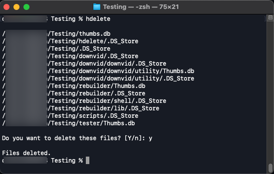

# hdelete
> Simple python tool to find and delete hidden OS files like thumbs.db or ds_store.



## Description
hdelete was initially a script created to deal with the various hidden operating system files generated when dealing
with file transfers between the three main platforms. The purpose of this project is my own tinkering and learning
Python build processes and stretching an initial idea into a more full-fledged and useful program.

Currently, hdelete only looks for `.DS_Store`, `Thumbs.db`, and files that start with `._` and gives you the option to 
delete them in one pass. Future iterations will build out to include options to select what type of file or directory
you would like to delete and include more mass generated files for cleanup.

## Setup
While this project is not really intended to be setup and/or installed - if you find you have a similar use case; 
you can download my hdelete script as a standalone to put within your own script directory on your system.

[hdelete standalone script](https://github.com/DChason/scripts-and-configs/blob/master/scripts/hdelete)

## Code Examples
hdelete in its current form is simple. Either navigate to the directory you want to check for the hidden files and run
hdelete or pass in the desired directory with the `--d` flag:
```
hdelete --d ~/foo/directory/path
```

## Status
Project is: _in progress_.

